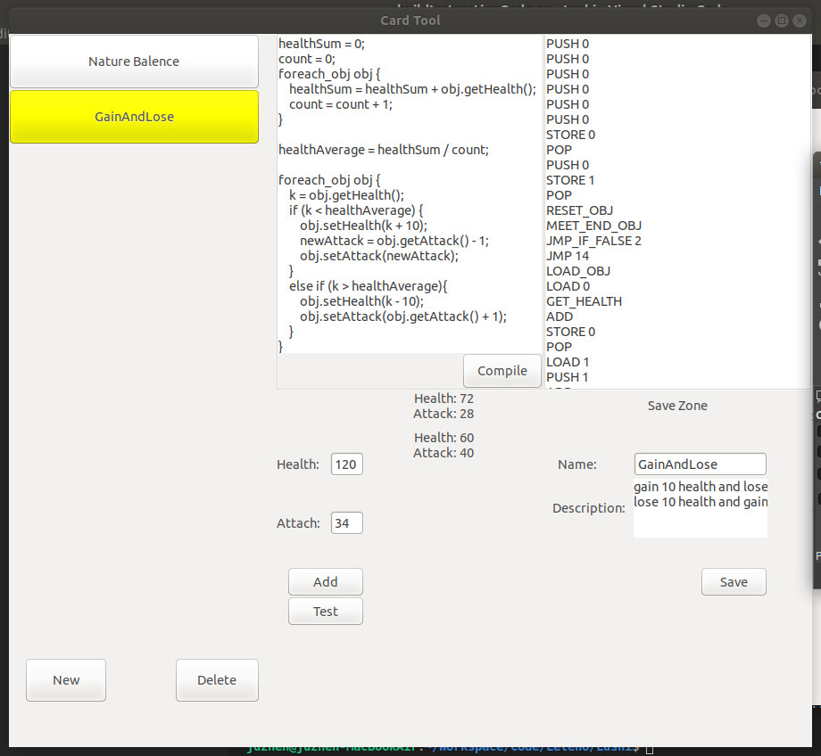

# Lushi

> I miss the old day when I played lushi, it brings me a lot of joy

Target:

- [ ] copy UI, UX
- [ ] developer can customize card
- [ ] make developer enjoy the game and customization, share with friends


Current step:

A CardTools to add Card Effect.

1. `/tools/GTK/install_gtk.sh`

2. build CardTools:

```
cd src/CardTools
make clean && make
./machine
```


